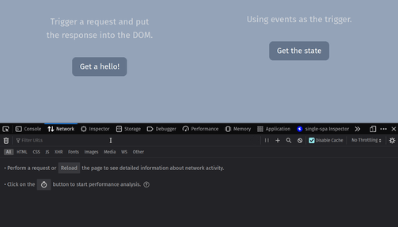

## HTMX "Hello World" example with Express

This is a minimal "hello world" example of using HTMX, having Express.js as the back-end.

 

### Usage

#### Prerequisites

1. Node.js (ver. 18 or newer) is needed.\
   If using NVM, a `.nvmrc` file is provided.
2. Install the dependencies using `npm install`.

#### Run

Run the app using `./run.sh` or using `node server.js`.

Access it at [localhost:3001](http://localhost:3001).
